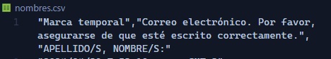

# generador-de-certificados-improvisado

- 👉 Nombre de la plantilla de canva → *template.jpg* (de usar otro nombre modificar el valor de la variable **template**)
- 👉 Nombre del listado para asistencia → *nombres.csv* (de usar otro nombre modificar el valor de la variable **presentes**)
- 👉 Nombre de la key con los nombres   
  
      
→ Buscarla en el .csv (en la linea 1 estan los nombres de las keys) y pegarla en la variable *keyNames*. Lo mas probable es que sea 'APELLIDO/S, NOMBRE/S:'