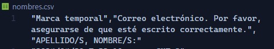

# generador-de-certificados-improvisado

### 1) Clonar repositorio
   
```powershell
 https://github.com/amartana/generador-de-certificados-improvisado.git 
```

### 2)  Instalar dependencias 
```
npm install
```

## 💥 IMPORTANTE ❗

### - Plantilla de canva:
* Descargar la plantilla de canva como jpg.
* Ponerle de nombre al archivo 👉  **template.jpg** (de usar otro nombre modificar el valor de la variable *template*)
*  Reemplazar el archivo *template-reemplazar.jpg* que se descargo con el repositorio, por el nuevo archivo template.jpg que acabamos de configurar.
### - Listado de asistencia:
* Descargar como csv las respuestas del forms de asistencia.
* Cambiar el nombre del archivo por 👉  **nombres.csv** (de usar otro nombre modificar el valor de la variable *presentes*)
*  Reemplazar el archivo *nombres-reemplazar.csv* que se descargo con el repositorio, por el nuevo archivo nombres.csv que acabamos de configurar.
### - Nombre de la key con el nombre de los alumnos:
* Buscarla en el archivo **nombres.csv** (**linea 1**) y pegarla en la variable *keyNames*. Lo mas probable es que sea **'APELLIDO/S, NOMBRE/S:'** 
  (*Es el item en el que se pidió en el forms que completen su nombre y apellido*).
  
 En la linea 1 del archivo nombres.csv se va a ver así 👇   
      
      
Si el nombre es exactamente el que se ve en la imagen, osea **'APELLIDO/S, NOMBRE/S:'**,  no cambiar nada, si es otro copiarlo tal cual, con comillas y todo, y pegarlo en la variable *keyNames*

